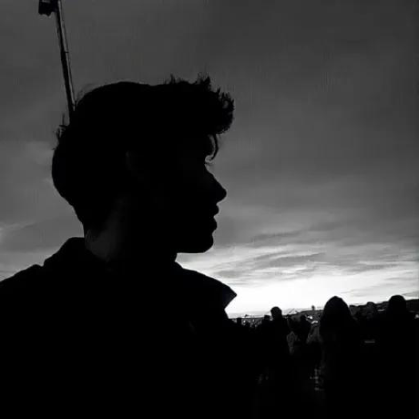

# 🌌 RAWMILK3017 — 3D Developer Portfolio

<div align="center">

  

  <h3><strong>Hi, I'm Rawmilk3017 | Creative Developer</strong></h3>
  <p>Discord Bot Developer • Web Developer • Open Source Developer • 3D Creative Engineer</p>

  <p>
    <a href="https://github.com/Rawmilk3017"></a>
    <a href="https://rawmilk3017.net"></a>
    
    
    
  </p>
</div>

---

## 🚀 Overview

A production-ready, ultra-premium 3D developer portfolio website built with **React**, **Three.js**, **React Three Fiber**, **React Three Drei**, **Tailwind CSS**, and **Framer Motion**.

Inspired by high-end spatial web experiences, this portfolio features full 3D interactive models, floating decal spheres, orbit controls, smooth parallax tilt effects, and an interactive contact planet.

---

## ✨ Features

- 🖥️ **Interactive 3D Retro Desktop PC (`ComputersCanvas`)**: Fully interactive 3D computer model in the Hero section with dynamic spot/point lighting and 360° orbit rotation.
- 🔮 **3D Floating Tech Balls (`BallCanvas`)**: Interactive 3D Icosahedron decal spheres representing core technologies that can be spun and tossed in real time.
- 🌍 **3D Rotating Planet (`EarthCanvas`)**: Realistic orbiting Earth model with atmosphere and cloud layers in the Contact section.
- ⭐ **Twinkling Starfield (`StarsCanvas`)**: 5,000 algorithmic procedural 3D stars floating and gently rotating across the deep space void.
- 🎴 **3D Parallax Tilt Cards**: Glare-enabled tilt cards for disciplines and projects powered by `react-parallax-tilt`.
- ⏳ **Experience Timeline**: Vertical interactive timeline powered by `react-vertical-timeline-component`.
- 💬 **Interactive Contact Section**: Instant email transmission, clipboard copy, and direct Discord community invite link.
- 📱 **100% Responsive**: Tailored for smooth 60fps performance across desktop, tablet, and mobile devices.

---

## 🛠️ Tech Stack

- **Core**: [React 19](https://react.dev/), [Vite](https://vitejs.dev/)
- **3D Graphics & Physics**: [Three.js](https://threejs.org/), [@react-three/fiber](https://r3f.docs.pmnd.rs/), [@react-three/drei](https://github.com/pmndrs/drei)
- **Styling & UI**: [Tailwind CSS](https://tailwindcss.com/), [Lucide React](https://lucide.dev/)
- **Animations & Interactivity**: [Framer Motion](https://www.framer.com/motion/), [React Parallax Tilt](https://github.com/mkosir/react-parallax-tilt), [React Vertical Timeline](https://github.com/stephane-monnot/react-vertical-timeline)

---

## 📂 Project Structure

```
rawmilk3017-portfolio/
├── public/
│   ├── desktop_pc/        # 3D Retro Computer GLTF model & PBR textures
│   └── planet/            # 3D Earth planet GLTF model & textures
├── src/
│   ├── assets/            # Tech badges, project previews, profile image
│   ├── components/
│   │   ├── canvas/        # Three.js 3D Canvas scenes (Computers, Ball, Earth, Stars)
│   │   ├── Navbar.jsx     # Floating responsive navigation bar
│   │   ├── Hero.jsx       # Hero section with 3D computer & scroll prompt
│   │   ├── About.jsx      # Overview with 3D Tilt cards
│   │   ├── Experience.jsx # Vertical experience timeline
│   │   ├── Tech.jsx       # Interactive 3D floating decal balls
│   │   ├── Works.jsx      # Project showcase cards with GitHub links
│   │   ├── Contact.jsx    # Contact form & 3D Earth canvas
│   │   └── Loader.jsx     # Three.js progress spinner
│   ├── constants/
│   │   └── index.js       # Centralized developer data, projects & experiences
│   ├── hoc/               # Higher-Order Component section wrappers
│   ├── utils/
│   │   └── motion.js      # Framer Motion animation variants
│   ├── App.jsx            # Root application layout
│   ├── styles.js          # Shared typography & responsive layout classes
│   ├── index.css          # Tailwind directives, custom gradients & keyframes
│   └── main.jsx           # App entry point
├── package.json
├── tailwind.config.js
└── vite.config.js
```

---

## 💻 Getting Started

### Prerequisites

Ensure you have **Node.js 18+** installed on your system.

### 1. Clone the Repository

```bash
git clone https://github.com/Rawmilk3017/rawmilk3017-portfolio.git
cd rawmilk3017-portfolio
```

### 2. Install Dependencies

```bash
npm install --legacy-peer-deps
```

### 3. Run Development Server

```bash
npm run dev
```

Open your browser and navigate to `http://localhost:5173/`.

### 4. Build for Production

```bash
npm run build
```

The optimized production assets will be built in the `dist/` directory.

To test the production build locally:

```bash
npm run preview
```

---

## 🌐 Deploy to Vercel

The portfolio is pre-configured and ready for instant deployment on [Vercel](https://vercel.com/):

1. Push this repository to your GitHub account.
2. Go to **Vercel** and click **"Add New Project"**.
3. Import your `rawmilk3017-portfolio` repository.
4. Framework Preset: **Vite**
5. Build Command: `npm run build`
6. Output Directory: `dist`
7. Click **Deploy**!

---

## 👤 Author

**Rawmilk3017 (Rawmilk3017.Exe)**
- **GitHub**: [@Rawmilk3017](https://github.com/Rawmilk3017/)
- **Website**: [Rawmilk3017](https://rawmilk3017.net)
- **Email**: [](mailto:)

---

## 📄 License & Attribution

- 3D Models:
  - *Desktop PC* by [yannick_sf](https://sketchfab.com/yannick_sf) licensed under [CC-BY-4.0](https://creativecommons.org/licenses/by/4.0/).
  - *Planet* licensed under [Creative Commons Attribution](https://creativecommons.org/licenses/by/4.0/).
- Inspired by the open-source 3D WebGL community.
